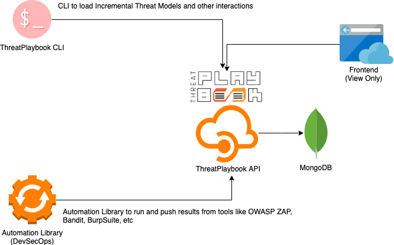

# Getting Started - ThreatPlaybook API

Previously, ThreatPlaybook was a pure-play CLI. While it was easier to run, it was not easy for multiple folks to collaborate across projects, features and threat models. 

Now ThreatPlaybook has an API component that can be deployed within your environment and accessed using the front-end or the CLI, based on the specific operations required. 

> The new architecture and set of components for ThreatPlaybook looks like this: 

## Technology (Built with)
* ThreatPlaybook's API has been primarily built with the following: 
    * [Responder Web Framework](https://python-responder.org/en/latest/)
    * [Graphene-Python](https://graphene-python.org/) for GraphQL. ThreatPlaybook is nearly 100% GraphQL
    * Frontend: VueJS 2.9.6
        * Bootstrap4
        * VisJS => Visualization Framework
    * Docopt => CLI framework for the API
    * MongoDB => Primary Backend Database
    * MongoEngine => Python ODM/ORM for Mongo
    * PyJWT for JSON Web Token implementation

## Installation
* Python version 3.6.x
* git clone this repo
* You'll need a MongoDB Database for this. We use MongoDB with Docker
* We are using pipenv for this project, however, you can still use standard `pip` with `virtualenv`
* if `pipenv`: 
    * clone the repo
    * cd `api/`
    * run `pipenv install`
    * run `pipenv shell`
    * run `python app.py`
* elif `pip`: 
    * clone the repo
    * cd `api/`
    * create virtualenv with `virtualenv venv`
    * activate virtualenv with `source venv/bin/activate`
    * install with `pip install -r requirements.txt`
* elif `docker` (recommended): 
    * Git clone repo
    * Run `docker-compose up` to bring up the stack
    * Read the [Docker Compose Instructions](/API/docker-compose.md)
* else: 
    * `print("There's no othert option left")`

## Configuration and Start
* Once you have the installation done, you should have the API running
    **If you are running the Docker compose installation, you can skip these steps**
* Let's configure the API Server: 
    * Run `python api_cli.py configure` and follow the options after
    * The options will prompt you for access to MongoDB and generate a JWT Token HMAC Password, which will be stored in a `.env` file which will be used as OS environment variables for your deployment
* If you are using Docker Compose deployment, you can change the superuser username and password environment variables to your preferred options. This creates a superuser account in ThreatPlaybook's API

### Security Notes
* ThreatPlaybook works with MongoDB with both authenticated and unauthenticated modes. Needless to say, we HIGHLY recommend that you use the authenticated MongoDB mode for a more secure experience
* Please consider using certs for the API service. LetsEncrypt gives it to you for free
* Please use complex, high-entropy passwords when you create users for ThreatPlaybook. The service internally uses Argon2 with reasonably high cost to store and verify passwords

Next: [API Usage](API-Usage.md)