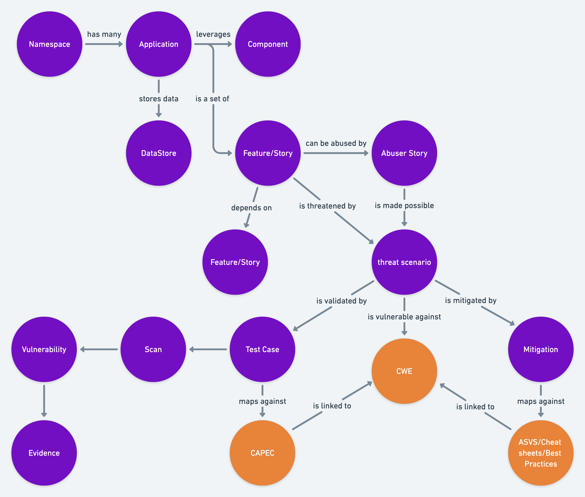

## ThreatPlaybook - Ideas

### Concepts

* Threat Models can be organized and represented as graphs. This is easier to retain and query complex relationships across types of datasets. 
* Graphs can be stored and queried across multiple levels

### Areas of Focus

[Models](Models.md)