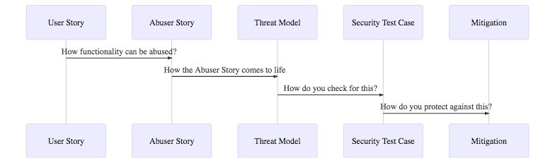

# ThreatPlaybook - Documentation
An action-oriented Framework that facilitates Threat-as-Code with Application Security Automation in a single Fabric

## Overview, Introduction and Motivation
Threat Modeling, according to the definition in the OWASP (Open Web Application Security Project) website is defined as: 
> An approach for analyzing the security of an application. It is a structured approach that enables you to identify, quantify, and address the security risks associated with an application.

We (at we45) believe that it is an essential practice that every organization should perform in order to achieve better security outcomes for its applications. We will not be delving into the details of threat modeling in this book, as there are great resources out there that you can use to understand Threat Modeling namely: 
* Adam Shostack's book on Threat Modeling 
* Microsoft's Threat Modeling Methodology, including STRIDE and others
* PASTA Threat Modeling Methodology

### Introduction
At we45, we have been using Threat Modeling for a variety of projects, ranging from Penetration Tests (where we perform Threat Modeling to identify attack opportunities against the target application), to specialized Architecture Review and Threat Modeling Projects, where our customers engage us to perform Threat Modeling for their applications/organization and subsequently analyze and implement some of the suggestions from this exercise. 

Another trend that we have seen over this time is that many of our customers, large and small have adopted Agile Development Practices (in some way/shape/form), as well as DevOps practices to accelerate their Development Practices and boost the productivity. This has resulted in a state of flux regarding how organizations approach threat modeling

### Problems with Threat Modeling today
* These are some of the key issues that we see with the way Threat Modeling is currently executed today within several organizations. 
* Threat Modeling is largely done as a static exercise (example - once a year) against a whole system
* Threat Modeling is relegated to the status of a "Document" where the results of a Threat Modeling exercise are captured in (usually) a massive document filled with impressive-looking diagrams, but in no way reflect the true position of the app as it is now, or the real risks of an application, as they are on the present date.
* Threat Modeling is predominantly performed by the organization's Information Security/Application Security teams who may have a very limited (technical) perspective of the risks to an application, but fail to capture the business risks (and their resulting technical risks)
* Threat Modeling is not iterative. When Threat Modeling is done once a year, or twice a year, it never keeps pace with the changing product landscape of the organization. Its not linked to the Agile Development Practices, the Product Backlog, and so on. 
* Because its not iterative, Threat Modeling is done with a "Macro Focus" (focus on the entire system) which ends up being very high level and doesn't drill down into specific features, thereby being more specific. In our opinion, "Specific is terrific!"
* Threat Modeling is not "Action Oriented" i.e, since it is just a "Document", it becomes the exclusive domain of the Security Team. The benefits of the Threat Modeling exercise do not flow to several teams/domains that could use it: 
* Product Managers/Domain Experts => To gain an idea of Business Risk
* Penetration Testers => Who can create Security Test Cases and prioritize the Pentest Better
* DevOps teams => Who can use the Threat Modeling Outputs as blueprints for security mitigations and so on
* Incident Response Professionals => Who can update their incident management plans better suited to business risks
* Architects => Who can design security into the next feature they create/design
* Too many Threat Modeling tools focus on "Diagramming". While Diagrams are very useful, they tend to become the dominant part of the Threat Modeling activity, which ends up yielding very generic Threat Models. While we are not opposed to Diagrams, we prefer Diagrams being generated[1], than composed

### Approach and Motivation
We wanted to address several of the issues (highlighted above) with Threat Modeling, which is why we adopted the "User-Story" Driven Approach to Threat Modeling, which can be represented as follows (this was a generated diagram BTW :)

### Story Driven Threat Modeling
This approach is comparable to some of the concepts expounded in PASTA. In this scenario, all of the threat modeling begins from the functionality (User Story/Use Case/Feature, whatever else you want to call it)

#### User Story

The User Story is a Description of the Functionality. This concept is very popular in the world of Agile Development, where an Agile Team picks a bunch of user stories to get done in a sprint. It is a Unit of Work to be completed in a sprint. A user story typically looks like this

As a user (salesperson), I should be able to access my customer's profile to be able to log call information with the customer 

#### Abuser Story

An Abuser Story is an "evil user's version" of a user story. An Abuser Story captures (at a high level) WHAT a threat actor can do to abuse the feature enumerated in the User Story. For example

> As a rival salesperson, I will access other salespeople's customers in the application to poach customers from my colleagues

#### Threat Model/Scenario

A Threat Model/Scenario is a description of HOW a threat actor can bring the abuser story to life. This is a scenario detailing the Attack Vector (primary technique for attack) and approach to bringing the Abuser Story to life. One can use STRIDE as an approach to capture various threats and use DREAD/CVSSv3 to capture impact of said attack. For example: 

**Abuser Story: As a rival salesperson, I will access other salespeople's customers in the application to poach customers from my colleagues**

> Attacker performs SQL Injection, to gain access to the Database of other customers in the System

> Attacker attempts to perform Insecure Direct Object Reference attacks, by incrementing the customer's ID value, gaining access to another customer's account

> Attacker steals a rival's session tokens by performing a Man-in-the-Middle Attack....

### Benefits of this approach
* This process is iterative. It is meant to keep step with the Agile Development practices. By enumerating Threats against User Stories, you are not threat modeling an entire/massive system, but going granular by enumerating threats against relevant user stories
* This process lends itself to speed. Instead of creating a massive Threat Model, you are quickly enumerating Threats that can go sprint by sprint.
* This process facilitates the creation of multiple segues into Security Test Cases and Mitigation Plans. You will see how this process works with an automated approach to security test cases

Proposed Solution

ThreatPlaybook was born in we45, as a framework to capture Threat Models for our internal Projects (especially Pentests). We have built it with the following parameters in mind: 
* **Threat Models as Code**: Codify Threat Models by Capturing User Stories => Abuser Stories => Threat Models/Scenarios and Test Cases in YAML files that can be parsed and processed by another system

* **Capture Security Test Cases**: Security Test Cases are descriptions of techniques used by security testers to test for specific vulnerabilities. These may include SAST, DAST tools, SCA tools, Reconnaissance tools and so on

* **Leverage Security Automation**: Inspired the Playbook style models of Ansible, Kubernetes, Metta and so on, we wanted to create framework that could amalgamate Threat Models, Test Cases and running of targeted Security Automation. We have used the Robot Framework to process the Threat Models and run the Security Automation Test Cases

### Proposed Benefits to Engineering Teams
* Go from Capturing and Running Threat Models, to running Security Test Cases in a CI/CD Pipeline with specific Robot Framework libraries like RoboZap, RoboNmap, etc
* We have created libraries for Zap, Burp, Arachni, etc that can be leveraged by Pentest Teams
* Perform Iterative Threat Models as Code and manage Threat Models in a repo like you would,  code.
* Perform Parameterized Application Security Testing - Leverage Robot Framework libraries for Selenium and REST API testing to "walkthrough" the application. This helps immensely with front-heavy apps or Web Services that cannot be "spidered" by the Web Vulnerability Scanner
* Leverage QA and non-security teams to create test cases - Robot Framework allows the creation of test cases with simple "natural language syntax"
* Create Security Regressions and load it back into the Test Suite to be run in the Pipeline
* Generate Reports that capture Threat Models, Vulnerabilities and a best case attempt to correlate Vulnerabilities to their related Threat Models based on CWE IDs

### Proposed Benefits to Pentesting Teams
* Go from Capturing and Running Threat Models, to running Security Test Cases in a Pentest Pipeline, thereby automating several activities, increasing a pentest team's productivity
* We have created libraries for Zap, Burp, Arachni, etc that can be leveraged by Pentest Teams
* Perform Iterative Threat Models as Code and manage Threat Models in a repo like you would,  code.
* Perform Parameterized Application Security Testing - Leverage Robot Framework libraries for Selenium and REST API testing to "walkthrough" the application. This helps immensely with front-heavy apps or Web Services that cannot be "spidered" by the Web Vulnerability Scanner
* Leverage QA and non-security teams to create test cases - Robot Framework allows the creation of test cases with simple "natural language syntax"
* Create Security Regressions and load it back into the Test Suite to be run in the Pipeline
* Generate Reports that capture Threat Models, Vulnerabilities and a best case attempt to correlate Vulnerabilities to their related Threat Models based on CWE IDs